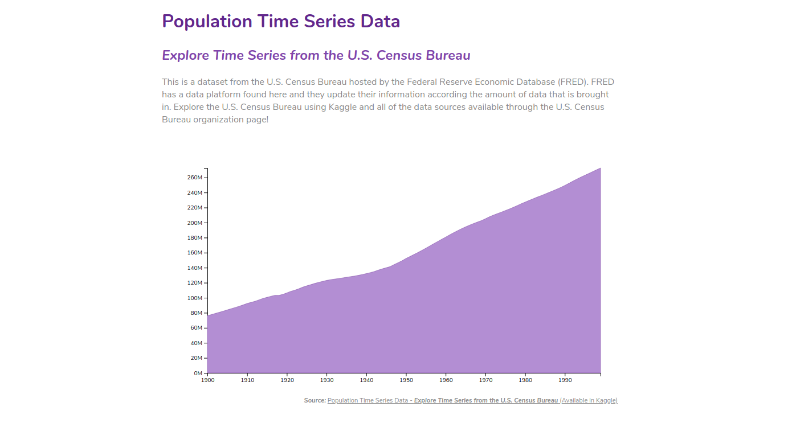

# Population-Time-Series-Data
Simple Data Visualization in D3.js with Time Series from the U.S. Census Bureau.

Using:
* D3.js (v4)
* ECMAScript 6
* Data Population Time Series. ([Available in Kaggle](https://www.kaggle.com/census/population-time-series-data))

See online:
https://marialuisacp.github.io/labviz---Population-Time-Series-Data/

